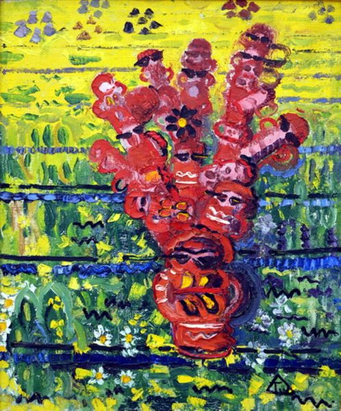

# La Contextressa
Repository to contain source code of the art / machine learning project La Contextressa

## Overview

La Contextressa was a year long project on AI and context in focus, conducted as an artistic research at FaVU in Brno, by Dragana Zarevska (FaVU) and Martin Kolařík (FEKT) – doctoral students and researchers at VUT, Brno. The project was conducted as an inter-faculty collaboration within frames of the junior SpV call at VUT.  In the initial phase of development of the narrative, La Contextressa was imagined as a strongly opinionated Italian Nonna who watch passengers down the street and comments on everyone and everything, at least to herself.  Later, she was turned into a device made of RaspberryPi, cameras and speakers and was trained to express simple opinions about objects in space describing them literally, but also trying to relate them to some metaphorical meaning. She was trained on COCO (common objects in context) and SemArt (semantic reading of art) datasets. La Contextressa is a poetic device, not purposed to guide people in galleries, she is rather useless in the conventional way: i.e. of producing economic value. Surrounded (and triggered to speak) by by few Italian-themed objects too (“curatables”), she is simply – just a girl, in her own world. A poetess. 

## Example

    
<b>Figure_1:</b> The galleries seem to be full of ... man is standing in front of fire hydrant ... but my unhumble experience would say ... ceiling of the galleria farnese ducale

## Citation and references

